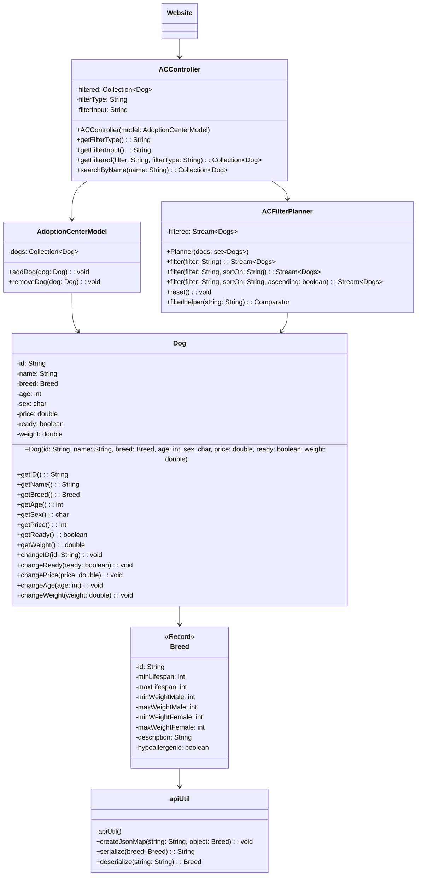

MERMAID DIAGRAM

```mermaid
classDiagram
class Dog {
    -id: String
    -name: String
    -breed: Breed
    -age: int
    -sex: char
    -price: double
    -ready: boolean
    -weight: double
    +Dog(id: String, name: String, breed: Breed, age: int, sex: char, price: double, ready: boolean, weight: double)
    +getID(): String
    +getName(): String
    +getBreed(): Breed
    +getAge(): int
    +getSex(): char
    +getPrice(): int
    +getReady(): boolean
    +getWeight(): double
    +changeID(id: String): void
    +changeReady(ready: boolean): void
    +changePrice(price: double): void
    +changeAge(age: int): void
    +changeWeight(weight: double): void
}
class Breed {
    <<Record>>
    -id: String
    -minLifespan: int
    -maxLifespan: int
    -minWeightMale: int
    -maxWeightMale: int
    -minWeightFemale: int
    -maxWeightFemale: int
    -description: String
    -hypoallergenic: boolean
}
class apiUtil {
    -apiUtil()
    +createJsonMap(string: String, object: Breed): void
    +serialize(breed: Breed): String
    +deserialize(string: String): Breed 
}
class AdoptionCenterModel {
    -dogs: Collection~Dog~
    +addDog(dog: Dog): void 
    +removeDog(dog: Dog): void
}
class ACController {
-filtered: Collection~Dog~
-filterType: String
-filterInput: String
+ACController(model: AdoptionCenterModel)
+getFilterType(): String
+getFilterInput(): String
+getFiltered(filter: String, filterType: String): Collection~Dog~
+searchByName(name: String): Collection~Dog~
}
class Website
class ACFilterPlanner {
	-filtered: Stream~Dogs~
	+Planner(dogs: set~Dogs~)
	+filter(filter: String): Stream~Dogs~
	+filter(filter: String, sortOn: String): Stream~Dogs~
	+filter(filter: String, sortOn: String, ascending: boolean): Stream~Dogs~
	+reset(): void
	+filterHelper(string: String): Comparator
}
Dog --> Breed
Breed --> apiUtil
AdoptionCenterModel --> Dog 
ACController --> AdoptionCenterModel
Website --> ACController
ACController --> ACFilterPlanner
ACFilterPlanner --> Dog
```
