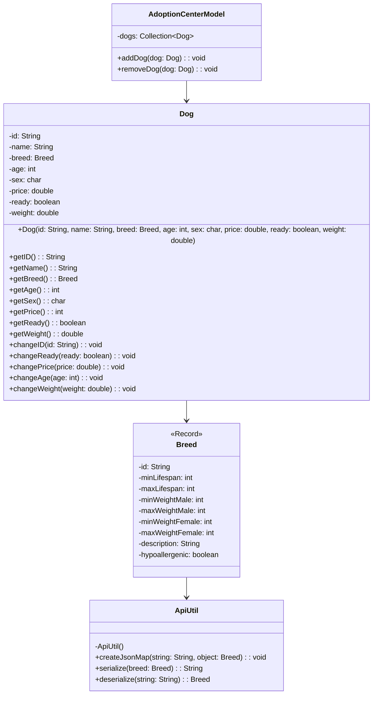

MERMAID DIAGRAM

```mermaid
classDiagram
class Dog {
    -id: String
    -name: String
    -breed: Breed
    -age: int
    -sex: char
    -price: double
    -ready: boolean
    -weight: double
    +Dog(id: String, name: String, breed: Breed, age: int, sex: char, price: double, ready: boolean, weight: double)
    +getID(): String
    +getName(): String
    +getBreed(): Breed
    +getAge(): int
    +getSex(): char
    +getPrice(): int
    +getReady(): boolean
    +getWeight(): double
    +changeID(id: String): void
    +changeReady(ready: boolean): void
    +changePrice(price: double): void
    +changeAge(age: int): void
    +changeWeight(weight: double): void
}
class Breed {
    <<Record>>
    -id: String
    -minLifespan: int
    -maxLifespan: int
    -minWeightMale: int
    -maxWeightMale: int
    -minWeightFemale: int
    -maxWeightFemale: int
    -description: String
    -hypoallergenic: boolean
}
class ApiUtil {
    -ApiUtil()
    +createJsonMap(string: String, object: Breed): void
    +serialize(breed: Breed): String
    +deserialize(string: String): Breed
}
class AdoptionCenterModel {
    -dogs: Collection~Dog~
    +addDog(dog: Dog): void
    +removeDog(dog: Dog): void
}
Dog --> Breed
Breed --> ApiUtil
AdoptionCenterModel --> Dog
```
