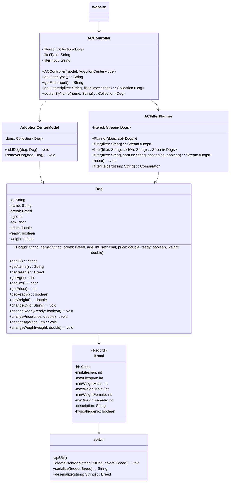

`Intial Ideas`:

`Adoption Center Main Model`

Dogs as objects with name, breed, age, sex as main fields. Hypoallergenic will be a boolean field that is dependent on breed.

Collection will be a list of Dog objects up for adoption.

https://dogapi.dog/docs/api-v2
We will use this API to get a list of breeds and their details to assign to our dog objects

It will need addDog, removeDog, changeDogAge, methods.
Add setPrice method()

Ready for adoption field, in order to be true, needs to have a price field set.
Image field tied to dog object that is the dog’s picture/optional field.

Main Model Responsibilities:

Philip - API integration and Dog object mapping

Joel -  API integration and Dog object mapping

Dina -  Altering the list to include these methods addDog, removeDog, changeDogAge methods.

Emily - Altering the list to include these methods addDog, removeDog, changeDogAge methods. 

`Adoption Center Controller`:

Parses user input:

Filters and returns inputted field to match what user wants to search whether its breed, age greaterthan/lessthan/equal, sex, hypoallergenic true/false
Sort by breed in alphabetical order or by age or by sex, maybe even name in alphabetical order

Search can search for name, age, breed, male and applies those filters
Only returns dogs ready for adoption

Controller Responsibilities:

Joel & Philip - MainController that reads user input

Dina & Emily - FilterPlanner that filters information from a filter command

`Adoption Center View`:

Website

Home page displays all the fields that can be filtered by. Maybe have the most populated breeds be displayed

Then have a search bar that can take arguments such as Breed: Terrier, Age: >3 that will return a list that links to the pages for all the dogs that match the criteria and those pages will have all the details of the dog, a larger picture, the age, the name, etc.

Everyone will work together on all features.

`Features`: 

Initial: 
1. Graphical User Interface (Can be a website or java swing/awt)
2. Be able to view all items in the collection - in a logical order
3. Be able to build a list of items from the collection
4. Be able to save out that list using a file format we covered in the course such as .xml, .json, or .csv.

Minimum: 
1. Be able to search for items in the collection
2. Be able to sort items in the collection
3. Be able to filter items in the collection
4. Include images for your items

`MERMAID DIAGRAM`

`Timeline`:

`Model`

July 27th -  API Integration done Philip and Joel
July 28th -  Framework (Dina, Emily) Completed by Sunday July 28
July 29th - Model status meetup.  Is the model complete?

`Controller` 

Completed by July 31  
July 31st - Controller status meetup, do we need to use the flexday for more time on the controller or we can move onto website

`Website`

Homepage 2nd-3rd 
August 2nd - Homepage meetup, is the homepage done, what is the progress

Dog Page details 4-5th
Done by August 5th 
August 6th - Finished website meetup, do we need to use the 7th to finish everything

`Presentation`

August 7th - Build Presentation for website 
August 8th - Build Presentation for website 

August 9th - Give Presentation 
