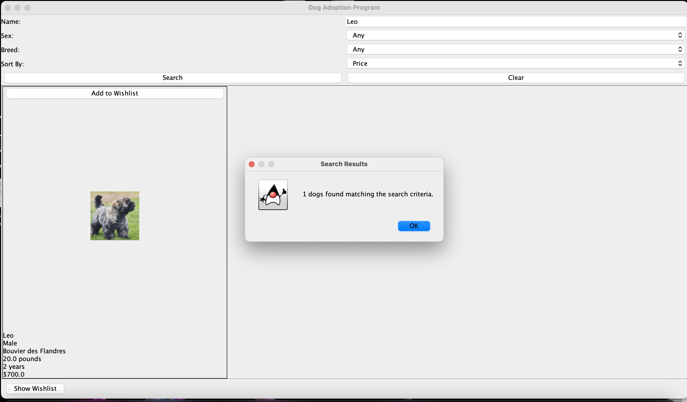

# Manual 

Dog Adoption Program User Manual

Introduction
The Dog Adoption Program is a graphical user interface (GUI) application that allows users to search for, view, and manage adoptable dogs. This manual will guide you through the features and functionality of the program.

Main Window
The main window is divided into three sections:
1. Search Panel (top)
2. Results Panel (center)
3. Wishlist Panel (bottom)

1. Search Panel

The search panel allows you to filter dogs based on various criteria:

- Name: Enter a dog's name or part of a name.
- Sex: Choose from "Any", "Male", or "Female".

- Breed: Select a specific breed or "Any".

- Sort By: Choose how to sort the results (Name, Age, Weight, or Price).

- Search Button: Click to perform the search based on your criteria.

- Clear Button: Click to reset all search fields and display all dogs.

2. Results Panel

This panel displays the search results in a grid format. Each dog is represented by:
- A photo
- Name
- Sex
- Breed
- Weight
- Age
- Price
- "Add to Wishlist" or "Remove from Wishlist" button

3. Wishlist Panel

- **Show Wishlist Button**: Click to open a dialog showing your current wishlist.

How to Use the Program

1. Searching for Dogs:
    - Enter your desired search criteria in the search panel.
    - Click the "Search" button to display matching dogs.
    - If no criteria are entered, all dogs will be displayed.

2. Viewing Dog Details:
    - Dog information is displayed directly in the results grid.

3. Managing the Wishlist:
    - To add a dog to your wishlist, click the "Add to Wishlist" button on the dog's panel.
    - To remove a dog from your wishlist, click the "Remove from Wishlist" button.
    - To view your entire wishlist, click the "Show Wishlist" button at the bottom of the window.
  
  

4. Saving the Wishlist:
    - In the wishlist dialog, click the "Save Wishlist" button.
    - Choose a location and filename to save your wishlist as a JSON file.
  
  
  

5. Clearing Search Results:
    - Click the "Clear" button in the search panel to reset all filters and display all dogs.

6. Sorting Results:
    - Use the "Sort By" dropdown in the search panel to order the results by Name, Age, Weight, or Price.

GUI Tips
- You can combine multiple search criteria for more specific results.
- The search is not case-sensitive for text fields.
- If you're not sure about a specific breed, you can leave the breed selection as "Any".
- Regularly check the wishlist to review your favorite dogs.
- Save your wishlist periodically if you want to keep a record of your favorite dogs.

---
